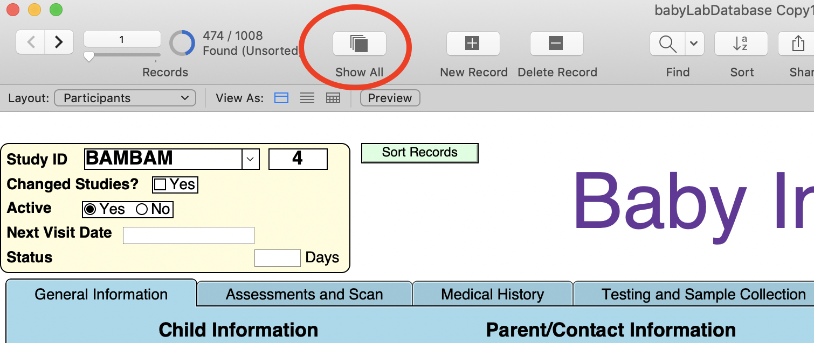
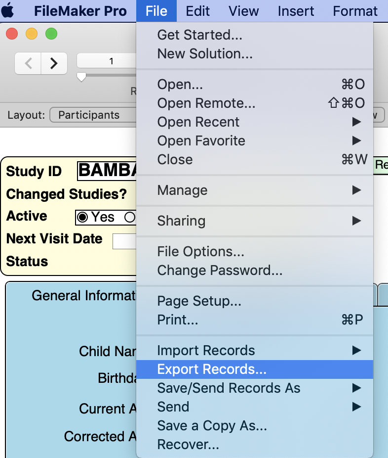
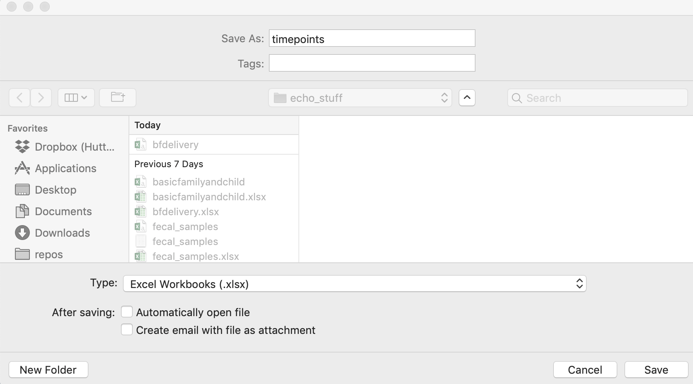
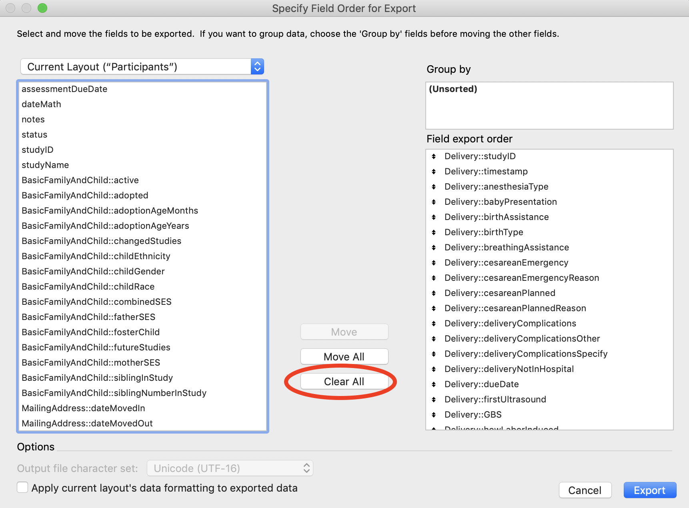
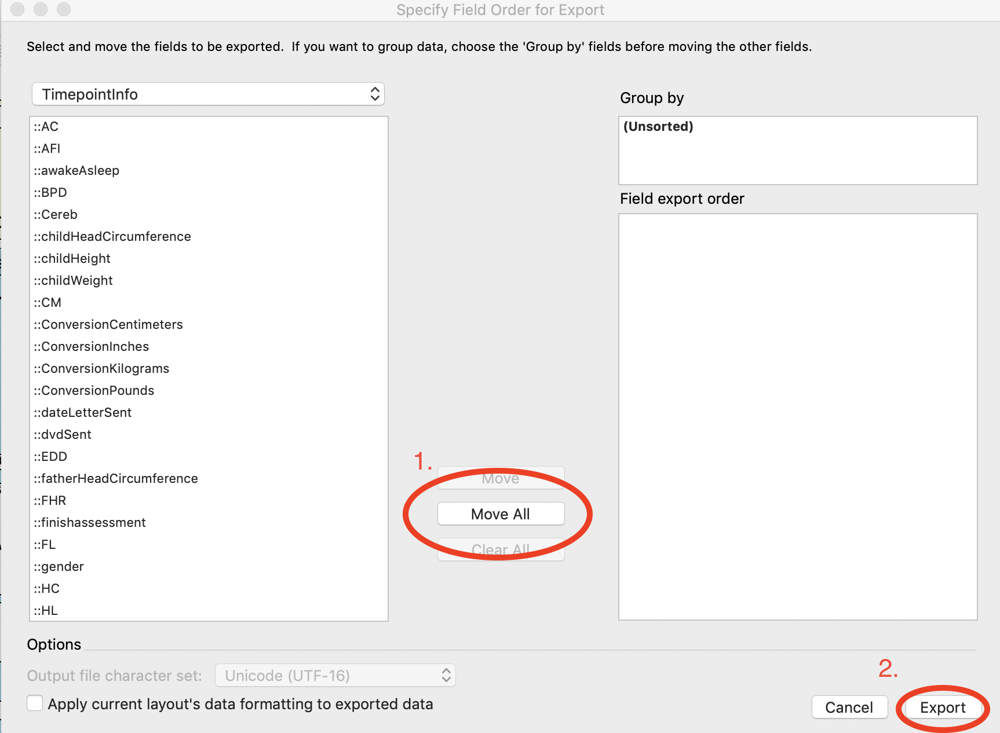

# Data for Analysis

```@contents
Pages=["01-data-sources.md"]
Depth=2
```

## Description

Raw data for this paper can be found here **link to OSF repo**

In order to perform the analyses outlined in the notebooks in this project,
**description of DataDeps**

## Metadata

Patient metadata is kept in a FileMaker Pro database,
and exported into a file that requires some effort to parse effectively.

### Export from FilemakerPro

The first step is to
export the relevant sections of the database as `.xlsx` (MS Excel) files.
First, make sure all records are being displayed
by clicking the `Show All` button (if it is not greyed out).



Next, export desired sections as an excel file.
The following demonstrates the steps
to get the metadata associated with timepoints,

1. Select `File > Export Records`
1. Select the location to save the file (eg `~/Desktop/timepoints`),
    and click `Save`
1. When the `Excel Options` dialogue box pops up, click `Continue`
1. In the `Specify Field Order for Export` dialogue box:
    1. If you've previously exported anything, clear those files
        by clicking `Clear All`
    1. Select a table to export.
        In this example, we'll select `Timpointinfo`
    1. Then click `Move All`
    1. Repeat for additional tables/fields, then `Export`










### Metadata Scrub

Once you have a this file,
run the `metascrub.jl` script contained in the `bin/` folder.
This script does a few things. First, it separates each parent table
(that is, the stuff before the `::`, eg `TimepointInfo`).
Second, it removes empty columns and rows
(that is, columns and rows that have only missing values).

Third, some custom processing is done for certain tables -
for example,
`collectionNum` in `FecalSampleCollection`
is renamed to `timepoint` to be consistent with other tables.
See the `customprocess()` function to see the table-specific steps.

Finally, the data is converted to long form.


| studyID  | timepoint | metadatum | value    | parent_table |
|----------|-----------|-----------|----------|--------------|
| Int      | Int       | String    | Any      | String       |

NOTE: Metadata from tables that don't have timepoints
(ie things that are the same at all timepoints)
are given a timepoint of `0`.

For more information, run the script with the `--help`:

```
$ julia --project=@. bin/metascrub.jl --help
usage: metascrub.jl [-d] [-v] [-q] [-l LOG] [--delim DELIM]
                    [--sheet SHEET] [--dry-run] [-o OUTPUT]
                    [-s SAMPLES] [-h] input

positional arguments:
  input                 Table to be scrubbed. By default, this will be
                        overwritten if a CSV file

optional arguments:
  -d, --debug           Show @debug level logging messages
  -v, --verbose         Show @info level logging messages
  -q, --quiet           Only show @error logging messages
  -l, --log LOG         Write logs to this file. Default - no file
  --delim DELIM         for tabular text files, the delimeter used
                        (generally ',' or '     ') (default: ",")
  --sheet SHEET         for xlsx files, the name of the sheet that
                        data is stored on (default: "Sheet1")
  --dry-run             Show logging, but take no action. Most useful
                        with --verbose
  -o, --output OUTPUT   Output for scrubbed file (defaults to
                        overwriting input)
  -s, --samples SAMPLES
                        Path to sample metadata to be included
                        (optional)
  -h, --help            show this help message and exit
```

For example, to run this script on our example above:

```sh
$ julia --project=@. bin/metascrub.jl ~/Desktop/echo_stuff/all.xlsx -vl data/metadata/filemakerdb.log -o data/metada
ta/filemakerdb.csv
```

Additional transformations of the metadata to get it into a usable form
can be found in the next notebook.

## Metagenome data

Compressed quality-scored sequencing files (`.fastq.gz`)
from the sequencing facility were concatenated
and run through the bioBakery metagenome workflow.
Each sample was sequenced on 4 lanes of Illumina {{TODO: add info about Illumina}}
generating paired-end reads.

### Concatenating raw sequencing files

Each set of 4 forward and reverse reads
were concatenated using the `catfastq.jl` script.

```
$ julia --project=@. bin/catfastq.jl --help
usage: catfastq.jl [-i IN-FOLDER] [--delete] [-o OUTPUT-FOLDER]
                   [--dry-run] [--debug] [-v] [-q] [-l LOG] [-h]

optional arguments:
  -i, --in-folder IN-FOLDER
                        Folder containing fastq files (default: ".")
  --delete              set to remove original files after
                        concatenation
  -o, --output-folder OUTPUT-FOLDER
                        destination folder for concatenated files
                        (default: "./")
  --dry-run             print messages but do nothing
  --debug               Show @debug level logging messages
  -v, --verbose         Show @info level logging messages
  -q, --quiet           Only show @error logging messages
  -l, --log LOG         Write logs to this file. Default - no file
  -h, --help            show this help message and exit
```

To run, assuming you have a folder containing the `fastq.gz` files
from the sequencing facility in a folder called `rawfastq/`:

```
$ julia --project=@. bin/catfastq.jl -i rawfastq/ -o catfastq/ -vl batch001_concatenate.log
```

### Running the bioBakery workflow

The bioBakery `wmgx` workflow was used on all samples
with the following software versions:

- Anadama2 v0.5
- bioBakery Workflows v0.10
- kneaddata v0.7
- metaphlan2 v2.2
- humann2 v0.11.1

The following command was run on the `regal` compute cluster from Harvard
research computing (a Centos7 environment).

```
$ biobakery_workflows wmgx --input catfastq/ --output analysis/ \
  --bypass-strain-profiling --pair-identifier .1 \
  --grid-jobs 96 --grid-partition serial_requeue,shared,240 # grid options
```

## 16S data

<!-- TODO: Add info about 16S analysis -->
