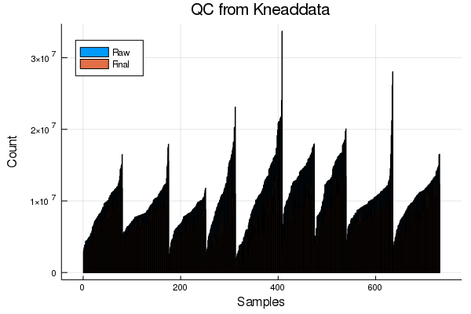

# Quality control of metagenomes

All of the metagenomes were processed
using tools from the [bioBakery](https://bitbucket.org/biobakery/biobakery/wiki/Home).

```@example qc
cd(dirname(@__FILE__)) # hide
ENV["GKSwstype"] = "100" # hide
```

```@example qc
using ECHOAnalysis
using CSV, DataFrames
using DataFramesMeta
using PrettyTables
```

## Quality control

First, I'll look at the QC results from `kneaddata`.

```@example qc
qc_files = let qcfiles=[]
    for (root, dirs, files) in walkdir(datatoml["tables"]["biobakery"]["path"])
        occursin("kneaddata", root) || continue
        filter!(files) do f
            occursin("read_counts", f)
        end
        append!(qcfiles, joinpath.(root, files))
    end
    qcfiles
end

# make a DataFrame of the first one
qc = CSV.read(qc_files[1])
qc[:batch] = "batch001"

# loop through the rest and concatenate to the first one
for f in qc_files[2:end]
    df = CSV.read(f)
    # get batch name from file
    df[:batch] = match(r"(batch\d+)", f).captures[1]
    global qc = vcat(qc, df)
end

pretty_table(first(qc, 15))
```

To keep the formatting of sample IDs consistant across data types,
I'll use the [`resolve_sampleID`](@ref) function.


```@example qc
qc[:Sample] = map(qc[:Sample]) do s
    s = replace(s, "_kneaddata"=> "")
    resolve_sampleID(s)[:sample]
end

pretty_table(first(qc,5))
```

```@example qc
# cleaning up the column names a bit
names!(qc,
    map(n-> Symbol(replace(String(n), " "=>"_")),
    names(qc)))
pretty_table(first(qc,5))
```

I don't really care about each mate pair individually,
so I'll sum them up

```@example qc
qc = @linq qc |>
  transform(raw = :raw_pair1 .+ :raw_pair2,
            trimmed = :trimmed_pair1 .+ :trimmed_pair2,
            orphan = :final_orphan1 .+ :final_orphan2,
            final = :final_pair1 .+ :final_pair2,
            )
pretty_table(first(qc,5)[[:Sample, :batch, :raw, :trimmed, :orphan, :final]])
```

Now let's take a look at them with some plots.

```@example qc
using StatsPlots

sort!(qc, [:batch, :raw])

bar(x=qc[:Sample], hcat(qc[:raw], qc[:final]),
    xaxis="Samples", yaxis= "Count", legend=:topleft,
    title = "QC from Kneaddata", label=["Raw" "Final"],
    line=0)

savefig("../../data/figures/04-knead-qc.svg"); nothing# hide
savefig("../../data/figures/04-knead-qc.png"); nothing# hide
```




These are a little more variable than I'd like.
Let's take a look at their properties:

```@example qc
using Statistics

qc_stats = by(qc, :batch) do df
                DataFrame(
                  mean = round(mean(df[:final]) / 1e6, digits=2),
                  med  = round(median(df[:final]) / 1e6, digits=2),
                  max  = round(maximum(df[:final]) / 1e6, digits=2),
                  min  = round(minimum(df[:final]) / 1e6, digits=2),
                  )
end
CSV.write("../../data/biobakery/kneaddata/qc_stats.csv", qc_stats) # hide
pretty_table(qc_stats)
```

## Functions

```@docs
resolve_sampleID
merge_tables
getmetadata
```
