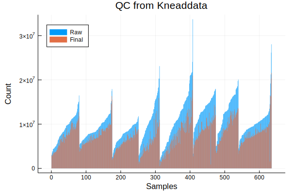
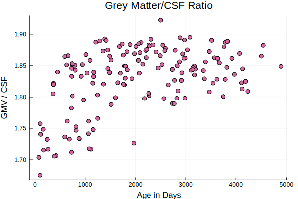

# Preliminary analysis of metagenomes

All of the metagenomes were processed
using tools from the [bioBakery](https://bitbucket.org/biobakery/biobakery/wiki/Home).

```@example 1
# cd(dirname(@__FILE__)) # hide
using ECHOAnalysis # hide
```

```@example 1
using Pkg.TOML: parsefile
using CSV, DataFrames
using DataFramesMeta
using PrettyTables

tables = parsefile("../../data/data.toml")["tables"]
biobakery = tables["biobakery"]
```

## Quality control

First, I'll look at the QC results from `kneaddata`.

```@example 1
qc_files = filter(readdir(biobakery["kneaddata"]["path"])) do f
    occursin("read_counts", f)
end

# get all of the qc files
qc_files = joinpath.(biobakery["kneaddata"]["path"], qc_files)
# make a DataFrame of the first one
qc = CSV.read(qc_files[1])
qc[:batch] = "batch001"

# loop through the rest and concatenate to the first one
for f in qc_files[2:end]
    df = CSV.read(f)
    # get batch name from file
    df[:batch] = match(r"(batch\d+)", f).captures[1]
    global qc = vcat(qc, df)
end

pretty_table(first(qc, 15))
```

To keep the formatting of sample IDs consistant across data types,
I'll use the [`resolve_sampleID`]@ref function.


```@example 1
qc[:Sample] = map(qc[:Sample]) do s
    s = replace(s, "_kneaddata"=> "")
    resolve_sampleID(s)[:sample]
end

pretty_table(first(qc,5))
```

```@example 1
# cleaning up the column names a bit
names!(qc,
    map(n-> Symbol(replace(String(n), " "=>"_")),
    names(qc)))
pretty_table(first(qc,5))
```

I don't really care about each mate pair individually,
so I'll sum them up

```@example 1
qc = @linq qc |>
  transform(raw = :raw_pair1 .+ :raw_pair2,
            trimmed = :trimmed_pair1 .+ :trimmed_pair2,
            orphan = :final_orphan1 .+ :final_orphan2,
            final = :final_pair1 .+ :final_pair2,
            )
pretty_table(first(qc,5)[[:batch, :raw, :trimmed, :orphan, :final]])
```

```@example 1
using StatsPlots

sort!(qc, [:batch, :raw])

bar(x=qc[:Sample], hcat(qc[:raw], qc[:final]),
    xaxis="Samples", yaxis= "Count", legend=:topleft,
    title = "QC from Kneaddata", label=["Raw" "Final"],
    line=0)

savefig("../../data/figures/03-knead-qc.svg"); # hide
```



These are a little more variable than I'd like.

```@example 1
using Statistics

qc_stats = by(qc, :batch) do df
                DataFrame(
                  mean=round(mean(df[:final]) / 1e6, digits=2),
                  med=round(median(df[:final]) / 1e6, digits=2),
                  max=round(maximum(df[:final]) / 1e6, digits=2),
                  min=round(minimum(df[:final]) / 1e6, digits=2),
                  )
end
CSV.write("../../data/biobakery/kneaddata/qc_stats.csv", qc_stats) # hide
pretty_table(qc_stats)
```

## Taxonomic Profiles

Taxonomic profiles come from [MetaPhlAn2](https://bitbucket.org/biobakery/metaphlan2/src).
Each sample is run separately, and needs to be joined in a single table.
I'll use the function [`merge_tables`]@ref


```@example 2
using ECHOAnalysis
using DataFrames
using PrettyTables
using CSV
using Microbiome
using MultivariateStats
using StatsPlots
using MicrobiomePlots
using BiobakeryUtils
using ColorBrewer

tax = merge_tables("../../data/biobakery/metaphlan/", "_profile.tsv")
# clean up sample names
names!(tax,
    map(n-> Symbol(
        resolve_sampleID(String(n))[:sample]),
        names(tax)
        )
    )
pretty_table(first(tax, 10))
```

Some analysis of the fungi:

```@example 2
euk = filter(tax) do row
    occursin(r"^k__Eukaryota", row[1])
end

# remove columns that don't have any fungi
euk = euk[map(c->
    !(eltype(euk[c]) <: Number) || sum(euk[c]) > 0, names(euk))]

CSV.write("euk.csv", euk)
# get a df with only species
taxfilter!(euk)
CSV.write("euk_sp.csv", euk)
pretty_table(euk)
```

Those numbers are out of 100...
so really not much fungi at all,
at least according to metaplan.
There are some other methods to look more specifically at fungi,
which will have to wait for another time.

### PCoA Plots

For an initial overview,
let's look at the PCoA plots using BrayCurtis dissimilarity.

#### All Samples

```@example 2
spec = taxfilter(tax)
phyla = taxfilter(tax, :phylum)
first(spec, 10) |> pretty_table
```


```@example 2
abt = abundancetable(spec)
pabt = abundancetable(phyla)
relativeabundance!(abt)
relativeabundance!(pabt);
```

```@example 2
dm = pairwise(BrayCurtis(), occurrences(abt))
mds = fit(MDS, dm, distances=true)

plot(mds, primary=false)
savefig("../../data/figures/03-basic_pcoa.svg") # hide
```

![(../../data/figures/03-basic_pcoa.svg)

```@example 2

function scree(mds)
    ev = eigvals(mds)
    var_explained = [v / sum(ev) for v in ev]
    bar(var_explained)
end

scree(mds, primary=false, line=0)
savefig("../../data/figures/03-scree.svg") # hide
```

![(../../data/figures/03-scree.svg)

```@example 2
color1 = ColorBrewer.palette("Set1", 9)
color2 = ColorBrewer.palette("Set2", 8)

c = [startswith(x, "C") ? color2[1] : color2[2] for x in samplenames(abt)]

p1 = plot(pco, marker=3, line=1, framestyle=1,
    color=c, primary=false)
scatter!([],[], color=color2[1], label="kids", legend=:topleft)
scatter!([],[], color=color2[2], label="moms", legend=:topleft)
title!("All samples taxonomic profiles")

savefig("../../data/figures/03-taxonomic-profiles-moms-kids.svg") # hide
```

![(../../data/figures/03-taxonomic-profiles-moms-kids.svg)

```@example 2
p2 = plot(pco, marker=3, line=1,
    zcolor=shannon(abt), primary = false, color=:plasma,
    title="All samples, shannon diversity")

savefig("../../data/figures/03-taxonomic-profiles-shannon.svg") # hide
```

![(../../data/figures/03-taxonomic-profiles-shannon.svg)

```@example 2
bacteroidetes = vec(Matrix(phyla[phyla[1] .== "Bacteroidetes", 2:end]))
firmicutes = vec(Matrix(phyla[phyla[1] .== "Firmicutes", 2:end]))

p3 = plot(pco, marker=3, line=1,
    zcolor=bacteroidetes, primary = false, color=:plasma,
    title="All samples, Bacteroidetes")

savefig("../../data/figures/03-taxonomic-profiles-bacteroidetes.svg") # hide
```

![(../../data/figures/03-taxonomic-profiles-bacteroidetes.svg)

```@example 2
p4 = plot(pco, marker=3, line=1,
    zcolor=firmicutes, primary = false, color=:plasma,
    title="All samples, Firmicutes")

savefig("../../data/figures/03-taxonomic-profiles-firmicutes.svg") # hide
```

![(../../data/figures/03-taxonomic-profiles-firmicutes.svg)

```@example 2
plot(p1, p2, p3, p4, marker = 2, markerstroke=0)
savefig("../../data/figures/03-taxonomic-profiles-grid.svg") # hide
```

![(../../data/figures/03-taxonomic-profiles-grid.svg)

#### Kids

Now, I'll focus on the kids in the group,
the samples that were stored in Genotek
and also remove duplicates
(since many of the kids are sampled more than once).

```@example 2
moms = view(abt, sites=map(s-> occursin(r"^M", s[:sample]) && occursin("F", s[:sample]),
                            resolve_sampleID.(sitenames(abt))))
unique_moms = let
    subjects= []
    unique = Bool[]
    for sample in sitenames(moms)
        s = resolve_sampleID(sample)
        if !in(s[:subject], subjects)
            push!(subjects, s[:subject])
            push!(unique,true)
        else
            push!(unique,false)
        end
    end
    unique
end


umoms = view(moms, sites=unique_moms)

kids = view(abt, sites=map(s-> occursin(r"^C", s[:sample]) && occursin("F", s[:sample]),
                            resolve_sampleID.(sitenames(abt))))
unique_kids = let
    subjects= []
    unique = Bool[]
    for sample in sitenames(kids)
        s = resolve_sampleID(sample)
        if !in(s[:subject], subjects)
            push!(subjects, s[:subject])
            push!(unique,true)
        else
            push!(unique,false)
        end
    end
    unique
end


ukids = view(kids, sites=unique_kids)

kids_dm = getdm(kids, BrayCurtis())
kids_pco = pcoa(kids_dm)

p5 = plot(kids_pco, marker=3, line=1,
    zcolor=shannon(kids), primary = false, color=:plasma,
    title="Kids, shannon diversity")

savefig("../../data/figures/03-taxonomic-profiles-kids-shannon.svg") # hide
```

![(../../data/figures/03-taxonomic-profiles-kids-shannon.svg)

```@example pkids = view(pabt, sites=map(s-> occursin(r"^C", s[:sample]) && occursin("F", s[:sample]),
                            resolve_sampleID.(sitenames(pabt))))
upkids = view(pkids, sites=unique_kids)

kids_bact = vec(collect(occurrences(view(pkids, species=occursin.("Bact", speciesnames(pkids))))))
kids_firm = vec(collect(occurrences(view(pkids, species=occursin.("Firm", speciesnames(pkids))))))
kids_act = vec(collect(occurrences(view(pkids, species=occursin.("Actino", speciesnames(pkids))))))
kids_proteo = vec(collect(occurrences(view(pkids, species=occursin.("Proteo", speciesnames(pkids))))))

plot(
    plot(kids_pco, marker=2, line=1,
        zcolor=kids_bact, primary = false, color=:plasma,
        title="Kids, Bacteroidetes"),
    plot(kids_pco, marker=2, line=1,
        zcolor=kids_firm, primary = false, color=:plasma,
        title="Kids, Firmicutes"),
    plot(kids_pco, marker=2, line=1,
        zcolor=kids_act, primary = false, color=:plasma,
        title="Kids, Actinobacteria"),
    plot(kids_pco, marker=2, line=1,
        zcolor=kids_proteo, primary = false, color=:plasma,
        title="Kids, Proteobacteria"),
    )
savefig("../../data/figures/03-taxonomic-profiles-kids-phyla.svg") # hide
```

![(../../data/figures/03-taxonomic-profiles-kids-phyla.svg)

In order to decorate these PCoA plots with other useful information,
we need to return to the metadata.
I'll use the [`getmetadata`]@ref function.

#### Brain Data

```@example 2
brainvol = CSV.read("../../data/brain/brain_volumes.csv")
names!(brainvol, map(names(brainvol)) do n
                        replace(String(n), " "=>"_") |> lowercase |> Symbol
                    end
        )


brainvol = stack(brainvol, [:white_matter_volume, :grey_matter_volume, :csf_volume], :study_id, variable_name=:metadatum)
rename!(brainvol, :study_id => :studyID)

# convert letter timepoint into number
gettp(x) = findfirst(lowercase(String(x)), "abcdefghijklmnopqrstuvwxyz")[1]

brainsid = match.(r"(\d+)([a-z])", brainvol[:studyID])
brainvol[:studyID] = [parse(Int, String(m.captures[1])) for m in brainsid]
brainvol[:timepoint] = [gettp(m.captures[2]) for m in brainsid]
brainvol[:parent_table] = "brainVolume"
allmeta = vcat(allmeta, brainvol)
```


```@example 2
samples = resolve_sampleID.(samplenames(kids))

subjects = [s.subject for s in samples]
timepoints = [s.timepoint for s in samples]
metadata = ["correctedAgeDays", "childGender", "APOE", "birthType",
            "exclusivelyNursed", "exclusiveFormulaFed", "lengthExclusivelyNursedMonths",
            "amountFormulaPerFeed", "formulaTypicalType", "milkFeedingMethods",
            "typicalNumberOfEpressedMilkFeeds", "typicalNumberOfFeedsFromBreast",
            "noLongerFeedBreastmilkAge", "ageStartSolidFoodMonths", "motherSES",
            "childHeight", "childWeight", "white_matter_volume", "grey_matter_volume", "csf_volume",
            "mullen_VerbalComposite", "VCI_Percentile", "languagePercentile"]

focusmeta = getmetadata(allmeta, subjects, timepoints, metadata)
focusmeta[:motherSES] = map(x-> ismissing(x) || x == "9999" ? missing : parse(Int, x), focusmeta[:motherSES])

focusmeta[:shannon] = shannon(kids)
focusmeta[:ginisimpson] = ginisimpson(kids)

focusmeta |> CSV.write("focus.csv") # hide

map(row-> any(!ismissing,
        [row[:mullen_VerbalComposite], row[:VCI_Percentile], row[:languagePercentile]]), eachrow(focusmeta)) |> sum
println() # hide
```

##### Birth type

```@example 2
plot(kids_pco, marker=3, line=1,
    color=metacolor(df[:birthType], color2[4:5], missing_color=color2[end]),
    title="Kids, BirthType", primary=false)
scatter!([],[], color=color2[4], label=unique(df[:birthType])[1])
scatter!([],[], color=color2[5], label=unique(df[:birthType])[2])
scatter!([],[], color=color2[end], label="missing", legend=:bottomright)

savefig("../../data/figures/03-taxonomic-profiles-kids-birth.svg") # hide
```

![(../../data/figures/03-taxonomic-profiles-kids-birth.svg)

##### Breastfeeding

Information about braestfeeding is spread across 2 different parent tables.
`BreastfeedingDone` indicates that the child is no longer breastfeeding,
and has a lot of information about formula use, solid food etc,
`BreastfeedingStill` is for kids that are still breastfeeding,
and has different information.

I'd like to distill all of this into:

1. breastfeeding: `true`/`false`,
2. formula: `true`/`false`

Both of these might be `true`.
In principle, they shouldn't both be `false`.

I defined [`breastfeeding`]@ref and [`formulafeeding`]@ref
to calculate these values.

```@example 2
# Make this function return `missing` instead of throwing an error
import Base.occursin
occursin(::String, ::Missing) = missing
occursin(::Regex, ::Missing) = missing

# make sure number rows are actually number types
for c in [:typicalNumberOfFeedsFromBreast, :typicalNumberOfEpressedMilkFeeds,
          :lengthExclusivelyNursedMonths, :noLongerFeedBreastmilkAge,
          :amountFormulaPerFeed]
    focusmeta[c] = [ismissing(x) ? missing : parse(Float64, x) for x in focusmeta[c]]
end


focusmeta[:breastfed] = breastfeeding.(eachrow(focusmeta))
focusmeta[:formulafed] = formulafeeding.(eachrow(focusmeta))
focusmeta |> CSV.write("../../data/metadata/metadata_with_brain.csv") # hide
```

```@example 2
bfcolor = let bf = []
    for row in eachrow(focusmeta)
        if row[:breastfed] && row[:formulafed]
            push!(bf, color1[1])
        elseif row[:breastfed]
            push!(bf, color1[2])
        elseif row[:formulafed]
            push!(bf, color1[3])
        else
            push!(bf, color1[end])
        end
    end
    bf
end

plot(kids_pco, marker=3, line=1,
    color=bfcolor,
    title="Kids, Breastfeeding", primary=false)
scatter!([],[], color=color1[2], label="breastfed")
scatter!([],[], color=color1[3], label="formula fed")
scatter!([],[], color=color1[1], label="both")
scatter!([],[], color=color1[end], label="missing", legend=:bottomright)

savefig("../../data/figures/03-taxonomic-profiles-kids-breastfeeding.svg") # hide
```

![(../../data/figures/03-taxonomic-profiles-kids-breastfeeding.svg)

```@example filter(focusmeta) do row
    !row[:breastfed] && !row[:formulafed]
end |> CSV.write("breastfeeding_missing.csv")
```

```@example 2
focusmeta[:correctedAgeDays] = [ismissing(x) ? missing : parse(Int, x) for x in focusmeta[:correctedAgeDays]]

@df focusmeta scatter(:correctedAgeDays, :white_matter_volume, label="wmv",
    xlabel="Age in Days", ylabel="Volume")
@df focusmeta scatter!(:correctedAgeDays, :grey_matter_volume, label="gmv")
@df focusmeta scatter!(:correctedAgeDays, :csf_volume, label="csf", legend=:bottomright)
title!("Brain Volumes")
ylims!(0, 3e5)
savefig("../../data/figures/03-brain-structures.svg") # hide
```

![(../../data/figures/03-brain-structures.svg)

```@example 2
wgr = focusmeta[:white_matter_volume] ./ focusmeta[:grey_matter_volume]
@df focusmeta scatter(:correctedAgeDays, wgr, title="White/Grey Matter Ratio", primary=false,
    xlabel="Age in Days", ylabel="WMV / GMV")
savefig("../../data/figures/03-brain-wgr.svg") # hide
```

![(../../data/figures/03-brain-wgr.svg)

```@example 2
gcr = focusmeta[:grey_matter_volume] ./ focusmeta[:csf_volume]
@df focusmeta scatter(:correctedAgeDays, gcr, title="Grey Matter/CSF Ratio", primary=false,
    xlabel="Age in Days", ylabel="GMV / CSF")
savefig("../../data/figures/03-brain-gcr.svg") #hide
```




## Functions

```@docs
resolve_sampleID
merge_tables
getmetadata
breastfeeding
formulafeeding
```
