# Taxonomic Profiles

Taxonomic profiles come from [MetaPhlAn2](https://bitbucket.org/biobakery/metaphlan2/src).
Each sample is run separately, and needs to be joined in a single table.
I'll use the function [`load_taxonomic_profiles`]@ref


```@example tax_profiles
# cd(dirname(@__FILE__)) # hide
ENV["GKSwstype"] = "100" # hide

using ECHOAnalysis
using DataFrames
using PrettyTables
using CSV
using Microbiome
using MultivariateStats
using StatsPlots
using MicrobiomePlots
using BiobakeryUtils
using Distances
using Clustering

outpath, figures = notebookpaths!(@__FILE__)

tax = load_taxonomic_profiles()
pretty_table(first(tax, 10))
```

Some analysis of the fungi:

```@example tax_profiles
euk = filter(tax) do row
    occursin(r"^k__Eukaryota", row[1])
end

# remove columns that don't have any fungi
euk = euk[map(c->
    !(eltype(euk[c]) <: Number) || sum(euk[c]) > 0, names(euk))]

CSV.write(joinpath(outpath, "euk.csv"), euk)
# get a df with only species
taxfilter!(euk)
CSV.write(joinpath(outpath, "euk_sp.csv"), euk)
pretty_table(euk)
```

Those numbers are out of 100...
so really not much fungi at all,
at least according to metaphlan.
There are some other methods to look more specifically at fungi,
which will have to wait for another time.

### PCoA Plots

For an initial overview,
let's look at the PCoA plots using BrayCurtis dissimilarity.

#### All Samples

```@example tax_profiles
spec = taxfilter(tax)
phyla = taxfilter(tax, :phylum)
first(spec, 10) |> pretty_table
```

Now I'll convert these to the `AbundanceTable` type from `Microbiome.jl`
for easier maniplation, and do Total Sum Scaling (convert to relative abundance).


```@example tax_profiles
abt = abundancetable(spec)
pabt = abundancetable(phyla)
relativeabundance!(abt)
relativeabundance!(pabt);
```

Using `pairwise` from `Distances.jl` and `MDS` from `MultivariateStats.jl`,
we perform classical multidimensional scaling (which is the same thing
as principle coordinates analysis).

```@example tax_profiles
dm = pairwise(BrayCurtis(), occurrences(abt), dims=2)
mds = fit(MDS, dm, distances=true)

include("pcoa_recipe.jl") # this won't be necessary after https://github.com/JuliaPlots/StatsPlots.jl/pull/230/

plot(mds, primary=false)
savefig(joinpath(figures, "basic_pcoa.svg")); nothing # hide
```

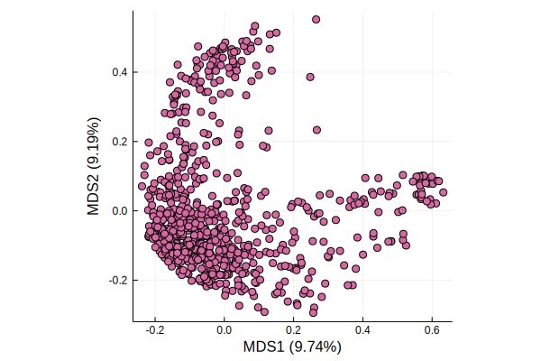

A scree plot can be used to visualize how many dimensions are necessary
to explain the bulk of the variance.

```@example tax_profiles
function scree(mds)
    ev = eigvals(mds)
    var_explained = [v / sum(ev) for v in ev]
    bar(var_explained, primary=false, line=0)
end

scree(mds)
ylabel!("Variance explained")
xlabel!("Principal coordinate axis")
savefig(joinpath(figures, "scree.svg")); nothing # hide
```


It looks like there are a couple of "elbows" in the plot,
but nice to see that the first few axes explain the bulk of the variance.
Later on, we'll try to determine what's driving those axes.

Now let's put some decoration on that PCoA plot.

##### Sample type

First, children vs mothers.
We can identify the difference by the "C" or "M"
at the beginning of the sample ID.

```@example tax_profiles
# colors defined in `startup.jl`
c = [startswith(x, "C") ? color2[1] : color2[2] for x in samplenames(abt)]

p1 = plot(mds, marker=3, line=1, framestyle=1,
    color=c, primary=false)
scatter!([],[], color=color2[1], label="kids", legend=:topright)
scatter!([],[], color=color2[2], label="moms", legend=:topright)
title!("All samples taxonomic profiles")

savefig(joinpath(figures, "taxonomic-profiles-moms-kids.svg")); nothing # hide
```

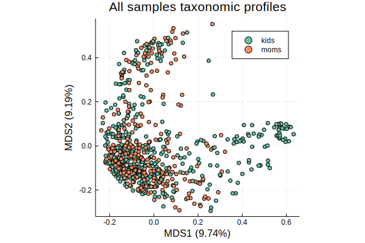

##### Diversity

The [`shannon`](@ref) function can calculate Shannon diversity for the entire `AbundanceTable`.

```@example tax_profiles
p2 = plot(mds, marker=3, line=1,
    zcolor=shannon(abt), primary = false, color=:plasma,
    title="All samples, shannon diversity")

savefig(joinpath(figures, "taxonomic-profiles-shannon.svg")); nothing # hide
```

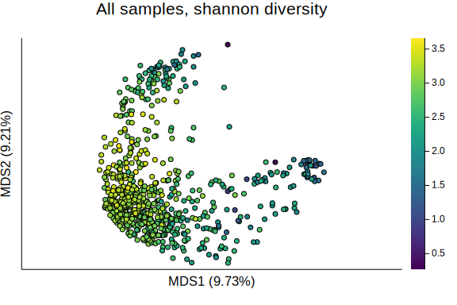

Neat! It looks like both of the first 2 axes of variation are related
to low vs high diversity.

##### Major Phyla

Because we were able to filter the original taxonomic profile by phyla,
we can also plot the relative abundace of the major phyla.
The ration of Bacteroidetes and Firmicutes are often visible in the first
axes of variation in adult microbiomes.

```@example tax_profiles
bacteroidetes = vec(Matrix(phyla[phyla[1] .== "Bacteroidetes", 2:end]))
firmicutes = vec(Matrix(phyla[phyla[1] .== "Firmicutes", 2:end]))

p3 = plot(mds, marker=3, line=1,
    zcolor=bacteroidetes, primary = false, color=:plasma,
    title="All samples, Bacteroidetes")

savefig(joinpath(figures, "taxonomic-profiles-bacteroidetes.svg")); nothing # hide
```

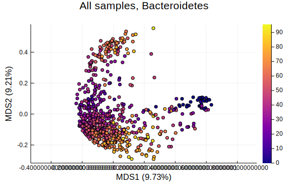

```@example tax_profiles
p4 = plot(mds, marker=3, line=1,
    zcolor=firmicutes, primary = false, color=:plasma,
    title="All samples, Firmicutes")

savefig(joinpath(figures, "taxonomic-profiles-firmicutes.svg")); nothing # hide
```

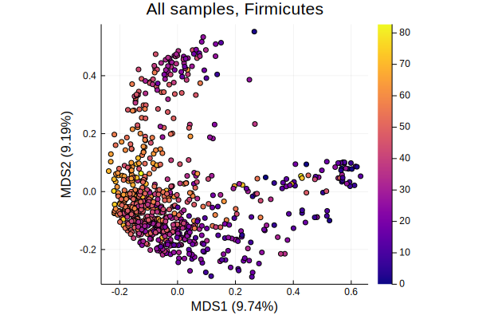

```@example tax_profiles
plot(p1, p2, p3, p4, marker = 2, markerstroke=0)
savefig(joinpath(figures, "taxonomic-profiles-grid.svg")); nothing # hide
```

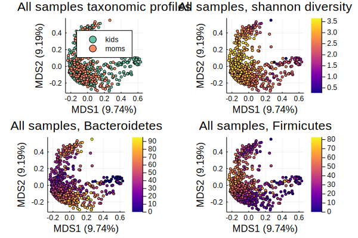

So that balance is somewhat visible, but there's something else going on too.

#### Moms

There aren't a ton of moms in the samples yet,
but let's just see what they look like on their own

```@example tax_profiles
# get a sub abundance table with only samples that start with "M"
moms = view(abt, sites=map(s-> occursin(r"^M", s[:sample]) && occursin("F", s[:sample]),
                            resolve_sampleID.(sitenames(abt))))

# this will get us a boolean vector to filter further so we only have
# one sample per mom.
unique_moms = let
    subjects= []
    unique = Bool[]
    for sample in sitenames(moms)
        s = resolve_sampleID(sample)
        if !in(s[:subject], subjects)
            push!(subjects, s[:subject])
            push!(unique,true)
        else
            push!(unique,false)
        end
    end
    unique
end


umoms = view(moms, sites=unique_moms)

# get pairwise Bray Curtis distance matrix
umoms_dm = pairwise(BrayCurtis(), umoms, dims=2)

# hierarchical clustering to put similar samples together
umoms_hcl = hclust(umoms_dm, linkage=:average, branchorder=:optimal)

abundanceplot(umoms, srt=umoms_hcl.order, topabund=11, title="Moms, top 11 species",
    xticks=false, color=color4')
savefig(joinpath(figures, "moms-abundanceplot.svg")); nothing # hide
```


```@example tax_profiles
abundanceplot(umoms, srt=umoms_hcl.order, topabund=11, title="Moms, top 11 species",
    xticks=false, color=color4', legend=false)
savefig(joinpath(figures, "moms-abundanceplot-nolegend.svg")); nothing # hide
```

Those look like normal adult microbiomes.

#### Kids

Now, I'll focus on the kids in the group,
the samples that were stored in Genotek
and also remove duplicates
(since many of the kids are sampled more than once).
The [`firstkids`](@ref) function identifies the first sample
for each kid

```@example tax_profiles

kids = view(abt, sites=firstkids(resolve_sampleID.(samplenames(abt))))

kids_dm = pairwise(BrayCurtis(), kids)
kids_mds = fit(MDS, kids_dm, distances=true)

p5 = plot(kids_mds, marker=3, line=1,
    zcolor=shannon(kids), primary = false, color=:plasma,
    title="Kids, shannon diversity")

savefig(joinpath(figures, "taxonomic-profiles-kids-shannon.svg")); nothing # hide
```

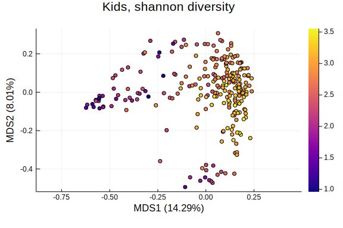

Let's look at the phyla too:

```@example tax_profiles

pkids = view(pabt, sites=firstkids(resolve_sampleID.(samplenames(abt))))

kids_bact = vec(collect(occurrences(view(pkids, species=occursin.("Bact", speciesnames(pkids))))))
kids_firm = vec(collect(occurrences(view(pkids, species=occursin.("Firm", speciesnames(pkids))))))
kids_act = vec(collect(occurrences(view(pkids, species=occursin.("Actino", speciesnames(pkids))))))
kids_proteo = vec(collect(occurrences(view(pkids, species=occursin.("Proteo", speciesnames(pkids))))))

plot(
    plot(kids_mds, marker=2, line=1,
        zcolor=kids_bact, primary = false, color=:plasma,
        title="Kids, Bacteroidetes"),
    plot(kids_mds, marker=2, line=1,
        zcolor=kids_firm, primary = false, color=:plasma,
        title="Kids, Firmicutes"),
    plot(kids_mds, marker=2, line=1,
        zcolor=kids_act, primary = false, color=:plasma,
        title="Kids, Actinobacteria"),
    plot(kids_mds, marker=2, line=1,
        zcolor=kids_proteo, primary = false, color=:plasma,
        title="Kids, Proteobacteria"),
    )
savefig(joinpath(figures, "taxonomic-profiles-kids-phyla.svg")); nothing # hide
```

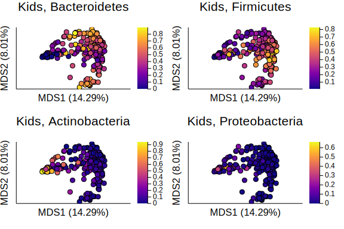

In order to decorate these PCoA plots with other useful information,
we need to return to the metadata.
I'll use the [`getfocusmetadata`]@ref function.

```@example tax_profiles
samples = resolve_sampleID.(samplenames(kids))
focusmeta = getfocusmetadata(datatoml["tables"]["metadata"]["all"]["path"], samples)
focusmeta[:shannon] = shannon(kids)
focusmeta[:ginisimpson] = ginisimpson(kids)

var_explained, eigenvalues, pco_axes = mds_axis_values(kids_mds)

scatter(pco_axes[:, 1], focusmeta[:correctedAgeDays] ./365,
    primary=false, zcolor = focusmeta[:shannon], color=:viridis)
ylabel!("Age (years)")
xlabel!("MDS1 ($(round(var_explained[1], digits = 2))%)")
title!("All kids age / PCoA 1 / Alpha diversity")

savefig(joinpath(figures, "taxonomic-profiles-kids-age-pco1-diversity.svg")); nothing # hide
```

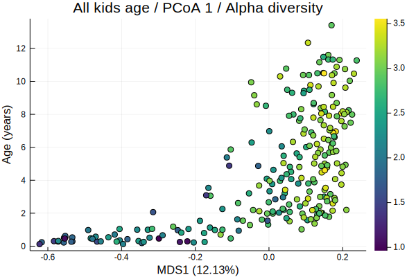

Here we can see that alpha diversity increases with age (not too surprising).
Another way to look at it is to plot the alpha diversity at each age:

```@example tax_profiles
focusmeta[:floorAge] = [ismissing(x) ? missing : Int(floor(x / 365)) for x in focusmeta[:correctedAgeDays]]

boxplot(collect(skipmissing(focusmeta[:floorAge])), focusmeta[:ginisimpson][.!ismissing.(focusmeta[:floorAge])],
    color=:lightgrey, legend=false, xlabel="Age in Years", ylabel="Alpha diversity (GiniSimpson)")
savefig(joinpath(figures, "kids-alpha-diversity-box.svg")); nothing # hide
```

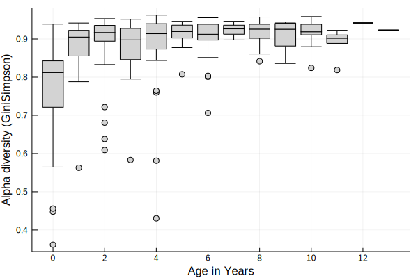


```@example tax_profiles
kids_hcl = hclust(kids_dm, linkage=:average, branchorder=:optimal)

abundanceplot(kids, srt = kids_hcl.order,
    title="Unique kids, top 10 species",
    xticks=false, color=color4')

savefig(joinpath(figures, "kids-abundanceplot.svg")); nothing # hide

abundanceplot(kids, srt = kids_hcl.order,
    title="Unique kids, top 10 species",
    xticks=false, color=color4', legend=false)

savefig(joinpath(figures, "kids-abundanceplot-nolegend.svg")); nothing # hide
```
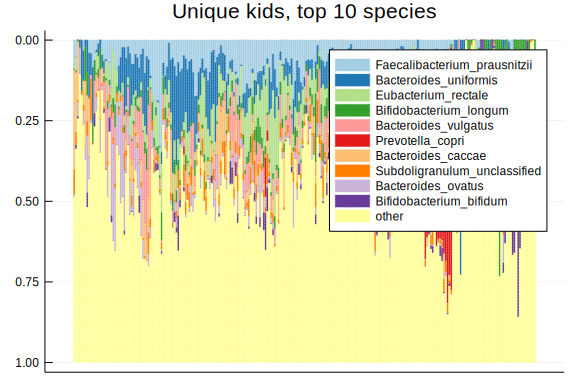
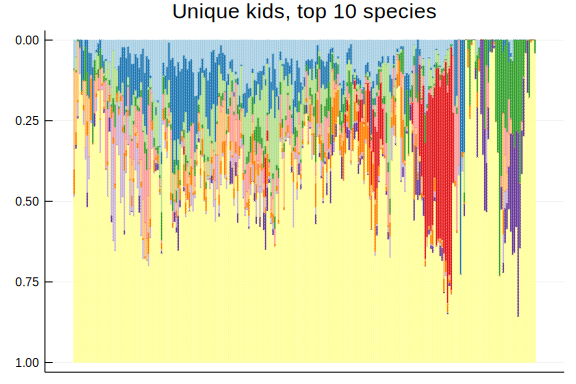

These also look like adult microbiomes, with a smattering of young-kids
microbes thrown in for good measure (eg _Bifidobacterium longum_).

We can also annotate this plot with the age of the kids

```@example tax_profiles
plot(
    abundanceplot(kids, srt = kids_hcl.order, title="Kids, top 10 species",
        xticks=false, color=color4', legend=false),
    heatmap(collect(Float64[ismissing(x) ? 0 : x / 365 for x in focusmeta[:correctedAgeDays][kids_hcl.order]]'),
        xticks=false, yticks=false, color=:PuBu, colorbar=false),
    layout = grid(2,1,heights=[0.9, 0.1])
    )
savefig(joinpath(figures, "kids-abundanceplot-age.svg")); nothing # hide
```

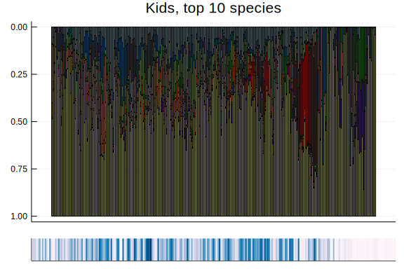


```@example tax_profiles
x = pco_axes[.!ismissing.(focusmeta[:correctedAgeDays]), 1]
y = pco_axes[.!ismissing.(focusmeta[:correctedAgeDays]), 2]

scatter(x, y, zcolor=focusmeta[.!ismissing.(focusmeta[:correctedAgeDays]), :correctedAgeDays] ./365,
    primary=false, color=:PuBu, title = "Unique Kids Taxonomic Profiles, Age")
xlabel!("MDS1 ($(round(var_explained[1], digits = 2))%)")
ylabel!("MDS2 ($(round(var_explained[2], digits = 2))%)")
savefig(joinpath(figures, "taxonomic-profiles-mds-kids-age.svg")); nothing # hide
```


Here' it looks like the outlying tail is the youngest kids.
Again, this makes sense. We know that infants microbiomes change quite a bit
over the first years of life.

Let's focus on just the youngest kids:

```@example tax_profiles
youngkids = map(x-> ismissing(x) ? false : x/365 < 2, focusmeta[:correctedAgeDays])

ykids = view(kids, sites = youngkids)
ykids_dm = pairwise(BrayCurtis(), ykids)
ykids_mds = fit(MDS, ykids_dm, distances=true)

ykids_hcl = hclust(ykids_dm, linkage=:average, branchorder=:optimal)
abundanceplot(ykids, srt = ykids_hcl.order, topabund=11, title="Kids under 2, top 10 species",
    xticks=false, color=color4')

savefig(joinpath(figures, "young-kids-abundanceplot.svg")); nothing # hide
```

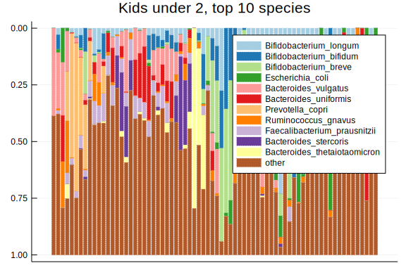

### Other Metadata Overviews

Eventually, we'll want to do statistical tests for associations,
but for now, just a bit more exploratory visualization.

#### Brain Volume Quartiles

```@example tax_profiles
using StatsBase

function colorquartile(arr, clrs)
    (q1, q2, q3) = percentile(collect(skipmissing(arr)), [25, 50, 75])
    length(clrs) > 4 ? mis = colorant"gray" : clrs[5]
    map(arr) do x
        ismissing(x) && return mis
        x < q1 && return clrs[1]
        x < q2 && return clrs[2]
        x < q3 && return clrs[3]
        return clrs[4]
    end
end

scatter(pco_axes[:, 1], focusmeta[:correctedAgeDays] ./ 365,
    color=colorquartile(focusmeta[:grey_matter_volume], color2[[1,2,3,4,end]]),
    markersize=5, primary=false)
scatter!([],[], color=color2[1], label="25th percentile")
scatter!([],[], color=color2[2], label="50th percentile")
scatter!([],[], color=color2[3], label="75th percentile")
scatter!([],[], color=color2[4], label="99th percentile")
scatter!([],[], color=color2[end], label="missing", legend=:topleft)
xlabel!("MDS1 ($(round(var_explained[1], digits = 2))%)")
ylabel!("Age (years)")

savefig(joinpath(figures, "kids-brain-quartiles.svg")); nothing # hide
```

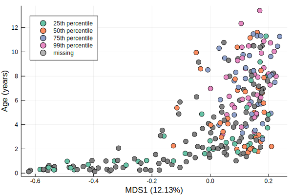


#### Birth type

Birth type (vaginal or cesarean) is known to have a substantial affect on kids'
microbiomes. Let's see where that falls in our data:

```@example tax_profiles
plot(kids_mds, marker=3, line=1,
    color=metacolor(focusmeta[:birthType], color2[4:5], missing_color=color2[end]),
    title="Kids, BirthType", primary=false)
scatter!([],[], color=color2[4], label=unique(focusmeta[:birthType])[1])
scatter!([],[], color=color2[5], label=unique(focusmeta[:birthType])[2])
scatter!([],[], color=color2[end], label="missing", legend=:bottomleft)

savefig(joinpath(figures, "taxonomic-profiles-kids-birth.svg")); nothing # hide
```

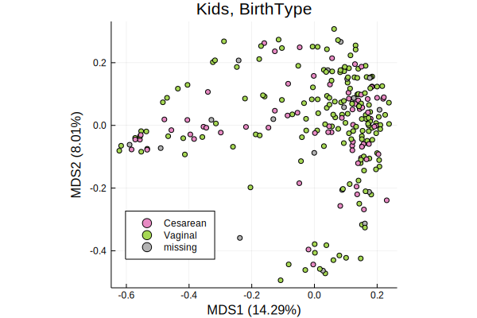

#### Breastfeeding

Information about braestfeeding is spread across 2 different parent tables.
`BreastfeedingDone` indicates that the child is no longer breastfeeding,
and has a lot of information about formula use, solid food etc,
`BreastfeedingStill` is for kids that are still breastfeeding,
and has different information.

I'd like to distill all of this into:

1. breastfeeding: `true`/`false`,
2. formula: `true`/`false`

Both of these might be `true`.
In principle, they shouldn't both be `false`.

I defined [`breastfeeding`](@ref) and [`formulafeeding`](@ref)
to calculate these values.

```@example tax_profiles
focusmeta[:breastfed] = breastfeeding.(eachrow(focusmeta))
focusmeta[:formulafed] = formulafeeding.(eachrow(focusmeta))

bfcolor = let bf = []
    for row in eachrow(focusmeta)
        if row[:breastfed] && row[:formulafed]
            push!(bf, color1[1])
        elseif row[:breastfed]
            push!(bf, color1[2])
        elseif row[:formulafed]
            push!(bf, color1[3])
        else
            push!(bf, color1[end])
        end
    end
    bf
end

plot(kids_mds, marker=3, line=1,
    color=bfcolor,
    title="Kids, Breastfeeding", primary=false)
scatter!([],[], color=color1[2], label="breastfed")
scatter!([],[], color=color1[3], label="formula fed")
scatter!([],[], color=color1[1], label="both")
scatter!([],[], color=color1[end], label="missing", legend=:bottomleft)

savefig(joinpath(figures, "taxonomic-profiles-kids-breastfeeding.svg")); nothing # hide
```

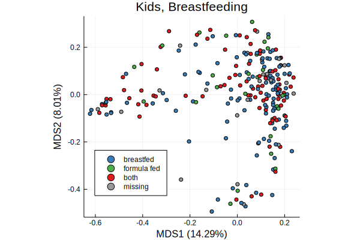

Nothing obvious from this level, but that's not necessarily surprising.
We need stats!

```@docs
load_taxonomic_profiles
load_metadata
shannon
getfocusmetadata
breastfeeding
formulafeeding
```
