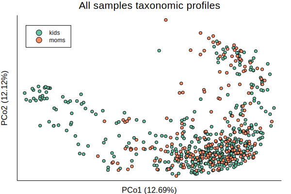
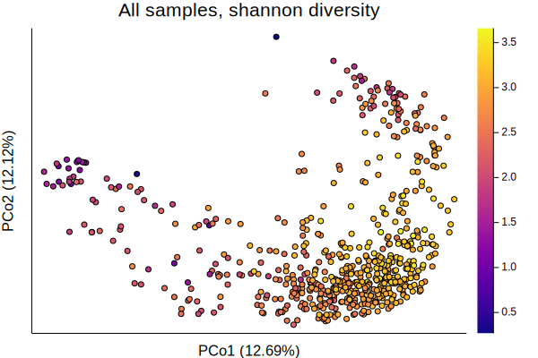
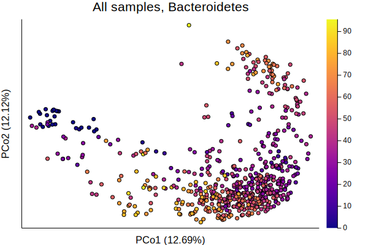
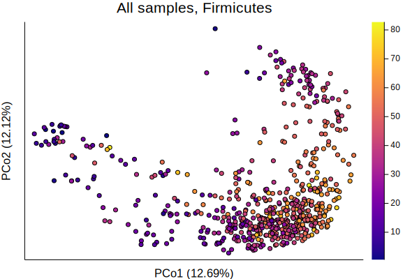
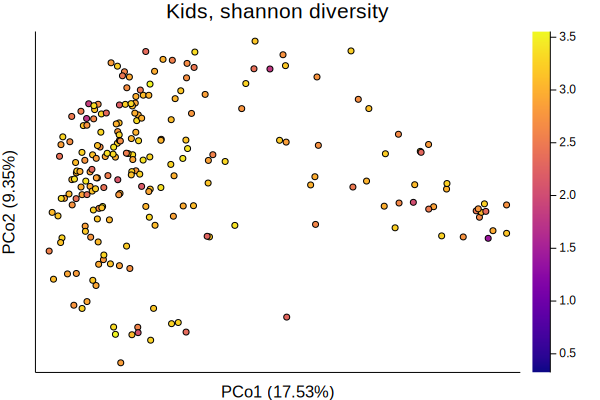
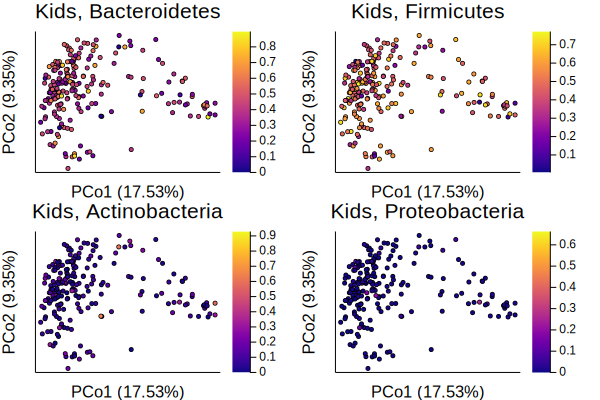
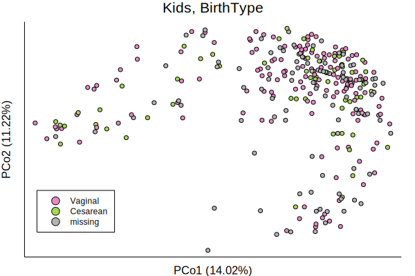
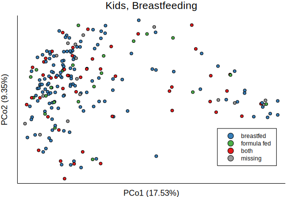

# Taxonomic Profiles

Taxonomic profiles come from [MetaPhlAn2](https://bitbucket.org/biobakery/metaphlan2/src).
Each sample is run separately, and needs to be joined in a single table.
I'll use the function [`merge_tables`]@ref


```@example tax_profiles
cd(dirname(@__FILE__)) # hide
ENV["GKSwstype"] = "100" # hide

using ECHOAnalysis
using Pkg.TOML: parsefile
using DataFrames
using PrettyTables
using CSV
using Microbiome
using MultivariateStats
using StatsPlots
using MicrobiomePlots
using BiobakeryUtils
using ColorBrewer
using Distances
using Clustering

tables = parsefile("../../data/data.toml")["tables"]
figsdir = parsefile("../../data/data.toml")["figures"]["path"]
datafolder = tables["biobakery"]["path"]
metaphlan = tables["biobakery"]["metaphlan2"]
outdir = metaphlan["analysis_output"]
isdir(outdir) || mkdir(outdir)
allmeta = CSV.File("../../data/metadata/merged_brain.csv") |> DataFrame


tax = merge_tables(datafolder, metaphlan["root"], metaphlan["filter"],
    suffix="_profile.tsv")

# clean up sample names
names!(tax,
    map(n-> Symbol(
        resolve_sampleID(String(n))[:sample]),
        names(tax)
        )
    )
pretty_table(first(tax, 10))
```

Some analysis of the fungi:

```@example tax_profiles
euk = filter(tax) do row
    occursin(r"^k__Eukaryota", row[1])
end

# remove columns that don't have any fungi
euk = euk[map(c->
    !(eltype(euk[c]) <: Number) || sum(euk[c]) > 0, names(euk))]

CSV.write(joinpath(outdir, "euk.csv"), euk)
# get a df with only species
taxfilter!(euk)
CSV.write(joinpath(outdir, "euk_sp.csv"), euk)
pretty_table(euk)
```

Those numbers are out of 100...
so really not much fungi at all,
at least according to metaplan.
There are some other methods to look more specifically at fungi,
which will have to wait for another time.

### PCoA Plots

For an initial overview,
let's look at the PCoA plots using BrayCurtis dissimilarity.

#### All Samples

```@example tax_profiles
spec = taxfilter(tax)
phyla = taxfilter(tax, :phylum)
first(spec, 10) |> pretty_table
```


```@example tax_profiles
abt = abundancetable(spec)
pabt = abundancetable(phyla)
relativeabundance!(abt)
relativeabundance!(pabt);
```

```@example tax_profiles
dm = pairwise(BrayCurtis(), occurrences(abt), dims=2)
mds = fit(MDS, dm, distances=true)

plot(mds, primary=false)
savefig(joinpath(figsdir, "05-basic_pcoa.svg")) # hide
```


```@example tax_profiles
function scree(mds)
    ev = eigvals(mds)
    var_explained = [v / sum(ev) for v in ev]
    bar(var_explained, primary=false, line=0)
end

scree(mds)
ylabel!("Variance explained")
xlabel!("Principal coordinate axis")
savefig(joinpath(figsdir, "05-scree.svg")) # hide
```


```@example tax_profiles
color1 = ColorBrewer.palette("Set1", 9)
color2 = ColorBrewer.palette("Set2", 8)
color3 = ColorBrewer.palette("Set3", 12)
color4 = ColorBrewer.palette("Paired", 12)

c = [startswith(x, "C") ? color2[1] : color2[2] for x in samplenames(abt)]

p1 = plot(mds, marker=3, line=1, framestyle=1,
    color=c, primary=false)
scatter!([],[], color=color2[1], label="kids", legend=:topright)
scatter!([],[], color=color2[2], label="moms", legend=:topright)
title!("All samples taxonomic profiles")

savefig(joinpath(figsdir, "05-taxonomic-profiles-moms-kids.svg")) # hide
```



```@example tax_profiles
p2 = plot(mds, marker=3, line=1,
    zcolor=shannon(abt), primary = false, color=:plasma,
    title="All samples, shannon diversity")

savefig(joinpath(figsdir, "05-taxonomic-profiles-shannon.svg")) # hide
```



```@example tax_profiles
bacteroidetes = vec(Matrix(phyla[phyla[1] .== "Bacteroidetes", 2:end]))
firmicutes = vec(Matrix(phyla[phyla[1] .== "Firmicutes", 2:end]))

p3 = plot(mds, marker=3, line=1,
    zcolor=bacteroidetes, primary = false, color=:plasma,
    title="All samples, Bacteroidetes")

savefig(joinpath(figsdir, "05-taxonomic-profiles-bacteroidetes.svg")) # hide
```



```@example tax_profiles
p4 = plot(mds, marker=3, line=1,
    zcolor=firmicutes, primary = false, color=:plasma,
    title="All samples, Firmicutes")

savefig(joinpath(figsdir, "05-taxonomic-profiles-firmicutes.svg")) # hide
```



```@example tax_profiles
plot(p1, p2, p3, p4, marker = 2, markerstroke=0)
savefig(joinpath(figsdir, "05-taxonomic-profiles-grid.svg")) # hide
```


#### Kids

Now, I'll focus on the kids in the group,
the samples that were stored in Genotek
and also remove duplicates
(since many of the kids are sampled more than once).

```@example
function optimalorder(hc::Hclust, dm::Array{Float64,2})
    ord = deepcopy(hc)
    optimalorder!(ord, dm)
    return ord
end


function optimalorder!(hc::Hclust, dm::Array{Float64,2})
    ord = hc.order
    orderleaves!(ord, hc, dm)
end

function orderleaves!(order::Vector{Int}, hcl::Hclust, dm::Array{Float64,2})
    extents = Tuple{Int,Int}[]
    for (vl, vr) in zip(hcl.merges[:,1], hcl.merges[:,2])
        (u, m, uidx, midx) = leaflocs(vl, order, extents)
        (k, w, kidx, widx) = leaflocs(vr, order, extents)
        if vl < 0 && vr < 0
            # Nothing needs to be done
        elseif vl < 0
            flp = flip1(m, k, w, dm)
            flp == 2 && reverse!(order, kidx, widx)
        elseif vr < 0
            flp = flip1(k, m, u, dm)
            (dm[k, m] > dm[k, u]) && reverse!(order, uidx, midx)
            flp == 2 && reverse!(order, uidx, midx)
       elseif vl > 0 && vr > 0
           flp = flip2(u, m, k, w, dm)
           (flp == 2 || flp == 4) && reverse!(order, uidx, midx)
           (flp == 3 || flp == 4) && reverse!(order, kidx, widx)
       else
           error("invalid 'merge' order in Hclust: ($vl, $vr) ")
       end
       push!(extents, (uidx, widx))
   end
end


function leaflocs(v::Int, order::Vector{Int}, extents::Vector{Tuple{Int,Int}})
    if v < 0
        leftextent = findfirst(abs(v) .== order)
        leftextent = rightextent = findfirst(==(-v), order)
        rightextent = leftextent
    elseif v > 0
        leftextent = extents[v][1]
        rightextent = extents[v][2]
    else
        error("leaf position cannot be zero")
    end
        left = order[leftextent]
        right = order[rightextent]
    return left, right, leftextent, rightextent
end


"""
For 1 multi-leaf branch and a leaf, determine if flipping branch is required
1 = do not flip
2 = flip right
"""
function flip1(m::Int, k::Int, w::Int, dm::Array{Float64,2})
    dm[m,k] <= dm[m,w] ? 1 : 2
end

"""
For 2 multi-leaf branches, determine if one or two flips is required
1 = do not flip
2 = flip left
3 = flip right
4 = flip both
"""
function flip2(u::Int, m::Int, k::Int, w::Int, dm::Array{Float64,2})
    argmin([dm[m,k], dm[u,k], dm[m,w], dm[u,w]])
end
```


```@example tax_profiles
moms = view(abt, sites=map(s-> occursin(r"^M", s[:sample]) && occursin("F", s[:sample]),
                            resolve_sampleID.(sitenames(abt))))
unique_moms = let
    subjects= []
    unique = Bool[]
    for sample in sitenames(moms)
        s = resolve_sampleID(sample)
        if !in(s[:subject], subjects)
            push!(subjects, s[:subject])
            push!(unique,true)
        else
            push!(unique,false)
        end
    end
    unique
end


umoms = view(moms, sites=unique_moms)
umoms_dm = pairwise(BrayCurtis(), umoms)
umoms_hcl = hclust(umoms_dm, linkage=:average)
optimalorder!(umoms_hcl, umoms_dm)

abundanceplot(umoms, srt=umoms_hcl.order, title="Moms, top 10 species",
    xticks=false, color=color4')
savefig(joinpath(figsdir, "05-moms-abundanceplot.svg"))
```


```@example tax_profiles

kids = view(abt, sites=map(s-> occursin(r"^C", s[:sample]) && occursin("F", s[:sample]),
                    resolve_sampleID.(sitenames(abt))))
ukids = view(abt, sites=firstkids(resolve_sampleID.(sitenames(abt))))

kids_dm = pairwise(BrayCurtis(), kids)
kids_mds = fit(MDS, kids_dm, distances=true)

ukids_dm = pairwise(BrayCurtis(), ukids)
ukids_mds = fit(MDS, ukids_dm, distances=true)
ukids_hcl = hclust(ukids_dm, linkage=:average)
optimalorder!(ukids_hcl, ukids_dm)

abundanceplot(ukids, srt = ukids_hcl.order, title="Kids, top 10 species",
    xticks=false, color=color4')
savefig(joinpath(figsdir, "05-kids-abundanceplot.svg"))
```


```@example tax_profiles
pcos = DataFrame(sampleID=samplenames(kids))
samples = resolve_sampleID.(samplenames(kids))
pcos[:studyID] = map(s-> s[:subject], samples)
pcos[:timepoint] = map(s-> s[:timepoint], samples)
pcos[:ginisimpson] = ginisimpson(kids)
pcos[:shannon] = shannon(kids)

proj = projection(kids_mds)


for i in 1:size(proj, 2)
    pcos[Symbol("Pco$i")] = proj[:,i]
end

CSV.write("/home/kevin/Desktop/tax_profile_pcos.csv", pcos)

p5 = plot(kids_mds, marker=3, line=1,
    zcolor=shannon(kids), primary = false, color=:plasma,
    title="Kids, shannon diversity")

savefig(joinpath(figsdir, "05-taxonomic-profiles-kids-shannon.svg")) # hide
```



```@example tax_profiles

pkids = view(pabt, sites=map(s-> occursin(r"^C", s[:sample]) && occursin("F", s[:sample]),
                            resolve_sampleID.(sitenames(pabt))))
upkids = view(pkids, sites=firstkids(resolve_sampleID.(sitenames(pkids))))

kids_bact = vec(collect(occurrences(view(pkids, species=occursin.("Bact", speciesnames(pkids))))))
kids_firm = vec(collect(occurrences(view(pkids, species=occursin.("Firm", speciesnames(pkids))))))
kids_act = vec(collect(occurrences(view(pkids, species=occursin.("Actino", speciesnames(pkids))))))
kids_proteo = vec(collect(occurrences(view(pkids, species=occursin.("Proteo", speciesnames(pkids))))))

plot(
    plot(kids_mds, marker=2, line=1,
        zcolor=kids_bact, primary = false, color=:plasma,
        title="Kids, Bacteroidetes"),
    plot(kids_mds, marker=2, line=1,
        zcolor=kids_firm, primary = false, color=:plasma,
        title="Kids, Firmicutes"),
    plot(kids_mds, marker=2, line=1,
        zcolor=kids_act, primary = false, color=:plasma,
        title="Kids, Actinobacteria"),
    plot(kids_mds, marker=2, line=1,
        zcolor=kids_proteo, primary = false, color=:plasma,
        title="Kids, Proteobacteria"),
    )
savefig(joinpath(figsdir, "05-taxonomic-profiles-kids-phyla.svg")) # hide
```



In order to decorate these PCoA plots with other useful information,
we need to return to the metadata.
I'll use the [`getmetadata`]@ref function.

```@example tax_profiles
samples = resolve_sampleID.(samplenames(kids))

focusmeta = getfocusmetadata(allmeta, samples)

using StatsPlots

scatter(focusmeta[:correctedAgeDays], proj[:,1], legend = false)
xlabel!("correctedAgeDays")
ylabel!("PCo.1")

focusmeta[:shannon] = shannon(kids)
focusmeta[:ginisimpson] = ginisimpson(kids)

focusmeta |> CSV.write("../../data/metadata/focus.csv") # hide
```

```@example tax_profiles
ukids_samples = resolve_sampleID.(samplenames(ukids))
ukids_subjects = [s.subject for s in ukids_samples]
ukids_timepoints = [s.timepoint for s in ukids_samples]
ukidsmeta = getfocusmetadata(allmeta, ukids_samples)
youngkids = ukidsmeta[:correctedAgeDays] ./ 365 .< 2
youngkids = [ismissing(x) ? false : x for x in youngkids]

ykids = view(ukids, sites = youngkids)
ykids_dm = pairwise(BrayCurtis(), ykids)
ykids_mds = fit(MDS, ykids_dm, distances=true)

ykids_hcl = hclust(ykids_dm, linkage=:average)
optimalorder!(ykids_hcl, ykids_dm)
abundanceplot(ykids, srt = ykids_hcl.order, title="Kids under 2, top 10 species",
    xticks=false, color=color4')
savefig(joinpath(figsdir, "05-young-kids-abundanceplot.svg"))


plot(
    abundanceplot(ukids, srt = ukids_hcl.order, title="Kids, top 10 species",
        xticks=false, color=color4'),
    heatmap(collect(Float64[ismissing(x) ? 0 : x / 365 for x in ukidsmeta[:correctedAgeDays][ukids_hcl.order]]'),
        xticks=false, yticks=false),
    layout = grid(2,1,heights=[0.9, 0.1])
    )

savefig(joinpath(figsdir, "05-kids-abundanceplot-age-heatmap.svg"))

plot(
    abundanceplot(ukids, srt=sortperm(ukidsmeta[:correctedAgeDays]), title="Kids, age sorted",
        xticks=false, color=color4'),
    heatmap(collect(Float64[ismissing(x) ? 0 : x / 365 for x in ukidsmeta[:correctedAgeDays][sortperm(ukidsmeta[:correctedAgeDays])]]'),
        xticks=false, yticks=false),
    layout = grid(2,1,heights=[0.9, 0.1])
    )

savefig(joinpath(figsdir, "05-kids-abundanceplot-age-sorted.svg"))

ukidsmeta[:floorAge] = [ismissing(x) ? missing : Int(floor(x / 365)) for x in ukidsmeta[:correctedAgeDays]]
ukidsmeta[:ginisimpson] = ginisimpson(ukids)

boxplot(collect(skipmissing(ukidsmeta[:floorAge])), ukidsmeta[:ginisimpson][.!ismissing.(ukidsmeta[:floorAge])],
    color=:lightgrey, legend=false, xlabel="Age in Years", ylabel="Alpha diversity (GiniSimpson)")
savefig(joinpath(figsdir, "05-kids-alpha-diversity-box.svg"))


let sn = speciesnames(ukids)
    for (i, sample) in enumerate(sn)
        ukidsmeta[Symbol(sample)] = asin.(sqrt.(occurrences(ukids)[i, :]))
    end
end


dm = pairwise(BrayCurtis(), ukids)
mds = fit(MDS, dm, distances=true)
proj = projection(mds)
for i in 1:nrow(ukidsmeta) -1
    ukidsmeta[Symbol("PCo$i")] = proj[:, i]
end

using StatsBase

function colorquartile(arr, clrs)
    (q1, q2, q3) = percentile(collect(skipmissing(arr)), [25, 50, 75])
    length(clrs) > 4 ? mis = colorant"gray" : clrs[5]
    map(arr) do x
        ismissing(x) && return mis
        x < q1 && return clrs[1]
        x < q2 && return clrs[2]
        x < q3 && return clrs[3]
        return clrs[4]
    end
end


ukidsmeta[:floorAge] = [ismissing(x) ? missing : Int(floor(x / 365)) for x in ukidsmeta[:correctedAgeDays]]
scatter(proj[:, 1], ukidsmeta[:correctedAgeDays] ./ 365,
    color=colorquartile(ukidsmeta[:grey_matter_volume], color2[[1,2,3,4,end]]),
    markersize=5, primary=false)
scatter!([],[], color=color2[1], label="25th percentile")
scatter!([],[], color=color2[2], label="50th percentile")
scatter!([],[], color=color2[3], label="75th percentile")
scatter!([],[], color=color2[4], label="99th percentile")
scatter!([],[], color=color2[end], label="missing", legend=:topleft)
xlabel!("MDS1 (14.47%)")
ylabel!("Age (years)")

savefig(joinpath(figsdir, "05-kids-brain-quartiles.svg"))


plot(mds, zcolor=[ismissing(x) ? 0 : x for x in ukidsmeta[:Escherichia_coli]])

focusmeta[:index] = [i for i in 1:nrow(focusmeta)]

```

##### Birth type

```@example tax_profiles
plot(kids_mds, marker=3, line=1,

    color=metacolor(focusmeta[:birthType], color2[4:5], missing_color=color2[end]),
    title="Kids, BirthType", primary=fale)
scatter!([],[], color=color2[4], label=unique(focusmeta[:birthType])[1])
scatter!([],[], color=color2[5], label=unique(focusmeta[:birthType])[2])
scatter!([],[], color=color2[end], label="missing", legend=:bottomright)

savefig(joinpath(figsdir, "05-taxonomic-profiles-kids-birth.svg")) # hide
```



##### Breastfeeding

Information about braestfeeding is spread across 2 different parent tables.
`BreastfeedingDone` indicates that the child is no longer breastfeeding,
and has a lot of information about formula use, solid food etc,
`BreastfeedingStill` is for kids that are still breastfeeding,
and has different information.

I'd like to distill all of this into:

1. breastfeeding: `true`/`false`,
2. formula: `true`/`false`

Both of these might be `true`.
In principle, they shouldn't both be `false`.

I defined [`breastfeeding`]@ref and [`formulafeeding`]@ref
to calculate these values.

```@example tax_profiles
# Make this function return `missing` instead of throwing an error
import Base.occursin
occursin(::String, ::Missing) = missing
occursin(::Regex, ::Missing) = missing

# make sure number rows are actually number types
for c in [:typicalNumberOfFeedsFromBreast, :typicalNumberOfEpressedMilkFeeds,
          :lengthExclusivelyNursedMonths, :noLongerFeedBreastmilkAge,
          :amountFormulaPerFeed]
    focusmeta[c] = [ismissing(x) ? missing : parse(Float64, x) for x in focusmeta[c]]
end


focusmeta[:breastfed] = breastfeeding.(eachrow(focusmeta))
focusmeta[:formulafed] = formulafeeding.(eachrow(focusmeta))
focusmeta |> CSV.write("../../data/metadata/metadata_with_brain.csv") # hide
```

```@example tax_profiles
bfcolor = let bf = []
    for row in eachrow(focusmeta)
        if row[:breastfed] && row[:formulafed]
            push!(bf, color1[1])
        elseif row[:breastfed]
            push!(bf, color1[2])
        elseif row[:formulafed]
            push!(bf, color1[3])
        else
            push!(bf, color1[end])
        end
    end
    bf
end

plot(kids_mds, marker=3, line=1,
    color=bfcolor,
    title="Kids, Breastfeeding", primary=false)
scatter!([],[], color=color1[2], label="breastfed")
scatter!([],[], color=color1[3], label="formula fed")
scatter!([],[], color=color1[1], label="both")
scatter!([],[], color=color1[end], label="missing", legend=:bottomright)

savefig(joinpath(figsdir, "05-taxonomic-profiles-kids-breastfeeding.svg")) # hide
```



```@example tax_profiles
filter(focusmeta) do row
    !row[:breastfed] && !row[:formulafed]
end |> CSV.write("../../data/metadata/breastfeeding_missing.csv")
```
