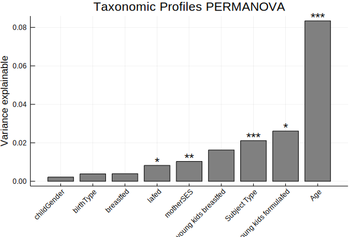

# Omnibus Tests


```@example omnibus
cd(dirname(@__FILE__)) # hide
ENV["GKSwstype"] = "100" # hide

using ECHOAnalysis
using Pkg.TOML: parsefile
using DataFrames
using PrettyTables
using CSV
using Microbiome
using MultivariateStats
using StatsPlots
using MicrobiomePlots
using BiobakeryUtils
using ColorBrewer

tables = parsefile("../../data/data.toml")["tables"]
figsdir = parsefile("../../data/data.toml")["figures"]["path"]
datafolder = tables["biobakery"]["path"]
metaphlan = tables["biobakery"]["metaphlan2"]
outdir = metaphlan["analysis_output"]
isdir(outdir) || mkdir(outdir)

meta = CSV.read(tables["metadata"]["sample_metadata"]["path"])
tax = merge_tables(datafolder, metaphlan["root"], metaphlan["filter"], suffix="_profile.tsv")

# clean up sample names
names!(tax,
    map(n-> Symbol(
        resolve_sampleID(String(n))[:sample]),
        names(tax)
        )
    )

taxfilter!(tax, :species)

abt = abundancetable(tax)
dm = getdm(abt, BrayCurtis())

samples = samplenames(abt)
subject_type = [startswith(s, "M") ? "Mother" : "Child" for s in samples]

perm = permanova(dm, subject_type)
perm[:feature] = "species"
perm[:variable] = "Subject Type"

```


```@example omnibus
kids = view(abt, sites=map(s-> occursin(r"^C", s[:sample]) && occursin("F", s[:sample]),
                            resolve_sampleID.(sitenames(abt))))

kids_dm = getdm(kids, BrayCurtis())

p = permanova(kids_dm, string.(meta[:subject]))
p[:feature] = "species"
p[:variable] = "StudyID"
perm = vcat(perm, p)

unique_kids = let
    subjects= []
    unique = Bool[]
    for sample in sitenames(kids)
        s = resolve_sampleID(sample)
        if !in(s[:subject], subjects)
            push!(subjects, s[:subject])
            push!(unique,true)
        else
            push!(unique,false)
        end
    end
    unique
end

ukids = view(kids, sites=unique_kids)

ukids_dm = getdm(ukids, BrayCurtis())
ukids_pco = pcoa(ukids_dm)

ukidsmeta = meta[unique_kids, :]

p = permanova(ukids_dm, ukidsmeta[:correctedAgeDays])
p[:feature] = "species"
p[:variable] = "Age"
perm = vcat(perm, p)

p = permanova(ukids_dm, ukidsmeta[:birthType])
p[:feature] = "species"
p[:variable] = "birthType"
perm = vcat(perm, p)

p = permanova(ukids_dm, ukidsmeta[:breastfed])
p[:feature] = "species"
p[:variable] = "breastfed"
perm = vcat(perm, p)

p = permanova(ukids_dm, ukidsmeta[:formulafed])
p[:feature] = "species"
p[:variable] = " lafed"
perm = vcat(perm, p)

p = permanova(ukids_dm, ukidsmeta[:childGender])
p[:feature] = "species"
p[:variable] = "childGender"
perm = vcat(perm, p)

ukidsmeta[:motherSES] = [(ismissing(x) || x == "9999") ? missing : x
                            for x in ukidsmeta[:motherSES]]

p = permanova(ukids_dm, ukidsmeta[:motherSES])
p[:feature] = "species"
p[:variable] = "motherSES"
perm = vcat(perm, p)

youngkids = view(ukids, sites=map(a-> !ismissing(a) && a < 365*2, ukidsmeta[:correctedAgeDays]))
youngkids_dm = getdm(youngkids, BrayCurtis())
youngkidsmeta = ukidsmeta[map(a-> !ismissing(a) && a < 365*2, ukidsmeta[:correctedAgeDays]), :]

p = permanova(youngkids_dm, youngkidsmeta[:breastfed])
p[:feature] = "species"
p[:variable] = "young kids breastfed"
perm = vcat(perm, p)

p = permanova(youngkids_dm, youngkidsmeta[:formulafed])
p[:feature] = "species"
p[:variable] = "young kids formulafed"
perm = vcat(perm, p)


filter!(r-> !ismissing(r[Symbol("Pr(>F)")]), perm)
CSV.write("../../data/permanovas.csv", perm)
```
```@example omnibus
using StatsPlots

sort!(perm, [:R2])
perm

bar(perm[1:end-1, :R2],
    xticks=(1:(size(perm,1)-1), perm[1:end-1, :variable]),
    xrotation=45, color=:grey)

for i in eachindex(perm[:R2])
    r2 = perm[i, :R2]
    p = perm[i, Symbol("Pr(>F)")]
    kind = perm[:variable]
    if p > 0.05
        continue
    elseif p > 0.01
        stars = "*"
    elseif p > .001
        stars = "**"
    else
        stars = "***"
    end
    annotate!(i, r2+.002, text(stars, :center))
end

plot!(legend=false, title="Taxonomic Profiles PERMANOVA",
    ylabel="Variance explainable")
savefig("../../data/figures/06-permanovas.svg")
```


