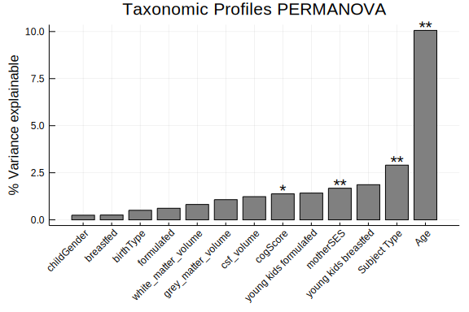

# Omnibus Tests

Here, we use permutational analysis of varianve
(or [PERMANOVA](https://en.wikipedia.org/wiki/Permutational_analysis_of_variance))
to identify how much of the variation in the microbiome
is explainable by different bits of metadata.
BiobakeryUtils.jl uses RCall to call the R package [vegan](https://cran.r-project.org/web/packages/vegan/index.html)
for their implimentation.

```@example omnibus
cd(dirname(@__FILE__)) # hide
ENV["GKSwstype"] = "100" # hide

using ECHOAnalysis
using DataFrames
using PrettyTables
using Microbiome
using Distances
using MultivariateStats
using StatsPlots
using CSV
using BiobakeryUtils

tax = load_taxonomic_profiles()
abt = abundancetable(tax)
relativeabundance!(abt)
dm = pairwise(BrayCurtis(), abt, dims=2)


samples = samplenames(abt)
subject_type = [startswith(s, "M") ? "Mother" : "Child" for s in samples]

perm = permanova(dm, subject_type)
perm[:feature] = "species"
perm[:variable] = "Subject Type"
pretty_table(perm)
```

This tells us that, when comparing all the samples, whether the sample
comes from a mom or a kid can explain ~3% of the variation,
and the result is significant (p < 0.001).
Technically, this p value is a bit anti-conservative,
since we have multiple samples per individual.
But that would take a bit of tweaking,
and we don't *really* need that number.

One way to demonstrate why this is a problem
is to look at how much of the variation is attributable to the subject ID.

```@example omnibus
metadata = load_metadata(datatoml, samples=resolve_sampleID.(samplenames(abt)))

# need to convert subject IDs to `String` so it's not treated as continuous variable
p = permanova(dm, string.(metadata[:subject]))
```

Here, we can see that over 80% of variability is attributable to who the person is.
Which is to say that people are really different!
Because of this, the numbers from PERMANOVA tend to be small (1-5%),
but even small differences are interesting.

Now we'll concatenate this new PERMANOVA into the previous dataframe to keep stuff together.

```@example ombnibus
p[:feature] = "species"
p[:variable] = "Subject ID"
perm = vcat(perm, p)
```

Now we'll focus on the kids.

```@example omnibus
kids = view(abt, sites=firstkids(samplenames(abt)))
kids_dm = pairwise(BrayCurtis(), kids, dims=2)

kidsmeta = load_metadata(datatoml, samples=resolve_sampleID.(samplenames(kids)))

p = permanova(kids_dm, kidsmeta[:correctedAgeDays], filter=.!ismissing.(kidsmeta[:correctedAgeDays]))
p[:feature] = "species"
p[:variable] = "Age"
perm = vcat(perm, p)

kidsmeta[:birthType] = Vector{Union{Missing,String}}(kidsmeta[:birthType])
p = permanova(kids_dm, kidsmeta[:birthType], filter=.!ismissing.(kidsmeta[:birthType]))
p[:feature] = "species"
p[:variable] = "birthType"
perm = vcat(perm, p)

kidsmeta[:breastfed] = breastfeeding.(eachrow(kidsmeta))
p = permanova(kids_dm, kidsmeta[:breastfed])
p[:feature] = "species"
p[:variable] = "breastfed"
perm = vcat(perm, p)

kidsmeta[:formulafed] = formulafeeding.(eachrow(kidsmeta))
p = permanova(kids_dm, kidsmeta[:formulafed])
p[:feature] = "species"
p[:variable] = " lafed"
perm = vcat(perm, p)

kidsmeta[:childGender] = Vector{Union{Missing,String}}(kidsmeta[:childGender])
p = permanova(kids_dm, kidsmeta[:childGender], filter=.!ismissing.(kidsmeta[:childGender]))
p[:feature] = "species"
p[:variable] = "childGender"
perm = vcat(perm, p)

p = permanova(kids_dm, kidsmeta[:motherSES], filter=.!ismissing.(kidsmeta[:motherSES]))
p[:feature] = "species"
p[:variable] = "motherSES"
perm = vcat(perm, p);

filter!(r-> !ismissing(r[Symbol("Pr(>F)")]), perm)

# round values in the table output (see https://ronisbr.github.io/PrettyTables.jl/stable/man/formatter/)
formatter = Dict(0 => (v,i) -> round(v,digits=3));
pretty_table(perm, formatter=formatter)
```

It's a bit surprising that breastfeeding and birth type are not significant,
though it may be because we're including older kids.
What happens if we only look at the kids under 2 years old?

```@example ombnibus
young = map(a-> !ismissing(a) && a < 365*2, kidsmeta[:correctedAgeDays])
youngkids = view(kids, sites=young)
youngkids_dm = pairwise(BrayCurtis(), youngkids, dims=2)
youngkidsmeta = kidsmeta[young, :]

p = permanova(youngkids_dm, youngkidsmeta[:breastfed])
p[:feature] = "species"
p[:variable] = "young kids breastfed"
perm = vcat(perm, p)

p = permanova(youngkids_dm, youngkidsmeta[:formulafed])
p[:feature] = "species"
p[:variable] = "young kids formulafed"
perm = vcat(perm, p)

filter!(r-> !ismissing(r[Symbol("Pr(>F)")]), perm)
pretty_table(perm, formatter=formatter)
```

Still not significant.
It could be that we don't have enough young kids to see the effect,
or that for some reason this cohort doesn't have major differences based on these factors.

Let's save the output after correcting for multiple testing.

```@example omnibus
using MultipleTesting

perm[:p_value] = Float64.(perm[Symbol("Pr(>F)")])
perm[:q_value] = adjust(perm[:p_value], BenjaminiHochberg())
sort!(perm, :q_value)

# reorder columns
perm = perm[[:feature, :variable, :R2, :p_value, :q_value]]

outpath, figures = notebookpaths!(@__FILE__)
CSV.write(joinpath(outpath, "permanovas.csv"), perm)
```

Let's see what that looks like in graphical form using StatsPlots

```@example omnibus
sort!(perm, [:R2])

# [1:end-1] removes the ~80% from subject ID
bar(perm[1:end-1, :R2] .* 100,
    xticks=(1:(size(perm,1)-1), perm[1:end-1, :variable]),
    xrotation=45, color=:grey)

for i in eachindex(perm[:R2])
    r2 = perm[i, :R2] * 100
    q = perm[i, :q_value]
    kind = perm[:variable]
    if q > 0.05
        continue
    elseif q > 0.01
        stars = "*"
    elseif q > .001
        stars = "**"
    else
        stars = "***"
    end
    annotate!(i, r2+.2, text(stars, :center))
end

plot!(legend=false, title="Taxonomic Profiles PERMANOVA",
    ylabel="% Variance explainable")
savefig(joinpath(figures, "permanovas.svg"))
```


