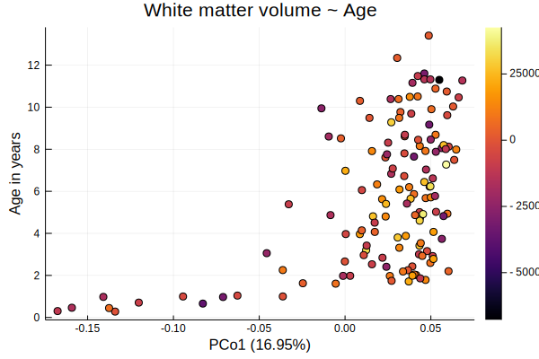

# Linear Models

```@example glm
cd(dirname(@__FILE__)) # hide
ENV["GKSwstype"] = "100" # hide

using ECHOAnalysis
using Pkg.TOML: parsefile
using DataFrames
using PrettyTables
using CSV
using Statistics
using Distances
using Microbiome
using MultivariateStats
using StatsPlots
using MicrobiomePlots
using BiobakeryUtils
using ColorBrewer
using Clustering

tables = parsefile("../../data/data.toml")["tables"]
figsdir = parsefile("../../data/data.toml")["figures"]["path"]
datafolder = tables["biobakery"]["path"]
metaphlan = tables["biobakery"]["metaphlan2"]
outdir = "../../data/glms"
isdir(outdir) || mkdir(outdir)

tax = merge_tables(datafolder, metaphlan["root"], metaphlan["filter"], suffix="_profile.tsv")

# clean up sample names
names!(tax,
    map(n-> Symbol(
        resolve_sampleID(String(n))[:sample]),
        names(tax)
        )
    )

taxfilter!(tax, :species)

abt = abundancetable(tax)
```

```@example glm
samples = resolve_sampleID.(samplenames(abt))
samples = samples[firstkids(samples)]

ukids_abt = view(abt, sites=firstkids(samples))
ukids_dm = pairwise(BrayCurtis(), ukids_abt)
ukids_mds = fit(MDS, ukids_dm, distances=true)

allmeta = CSV.File("../../data/metadata/merged_brain.csv") |> DataFrame

focusmeta = getfocusmetadata(tables["metadata"]["merged_brain"]["path"], samples)
```


```@example glm
relativeabundance!(ukids_abt)

focusmeta[:sample] = samplenames(ukids_abt)
complete = map(eachrow(focusmeta)) do df
    !ismissing(df.birthType) &&
    !ismissing(df.correctedAgeDays)
end


kids_spec = DataFrame(species=speciesnames(ukids_abt))

let sn = samplenames(ukids_abt)
    for i in eachindex(sn)
        kids_spec[Symbol(sn[i])] = occurrences(ukids_abt)[:, i]
    end
end

CSV.write("../../data/metadata/unique_kids_metadata.tsv",
            focusmeta[[:sample, :correctedAgeDays, :motherSES, :birthType, :white_matter_volume, :grey_matter_volume, :csf_volume, :formulafed]],
            delim='\t')

!isdir("../../data/maaslin") && mkdir("../../data/maaslin")
CSV.write("../../data/maaslin/kids_species.tsv", kids_spec, delim='\t')
```


```@example glm

birthType = by(focusmeta, [:motherSES]) do df
    vag = count(isequal("Vaginal"), df[:birthType])
    csec = count(isequal("Cesarean"), df[:birthType])
    total = vag+csec
    DataFrame(percent_vag=(vag / total), count=total)
end

filter!(birthType) do row
    !ismissing(row[:motherSES])
end
sort!(birthType[:motherSES])

@df birthType bar(:motherSES, :percent_vag, legend = false,
    xlabel="Maternal SES", ylabel="Fraction vaginal birth")
ylims!(0, 0.9)
ylabel!("Fraction Vaginal Birth")
```

```@example glm
using RCall

R"""
 library(Maaslin2)
 fit_data <- Maaslin2("../../data/maaslin/kids_species.tsv", "../../data/metadata/unique_kids_metadata.tsv", "../../data/maaslin2_spec/")
 """
```

```@example glm
using GLM

sn = speciesnames(ukids_abt)
occ = occurrences(ukids_abt)
for i in eachindex(sn)
    focusmeta[Symbol(sn[i])] = collect(occ[i, :])
end

let proj = projection(ukids_mds)
    for i in 1:size(proj, 2)
        focusmeta[Symbol("PCo$i")] = proj[:, i]
    end
end

focusmeta[:white_matter_volume] = Union{Missing, Float64}[x for x in focusmeta[:white_matter_volume]]
focusmeta[:logage] = log.(focusmeta[:correctedAgeDays])

@df focusmeta scatter(:logage, :white_matter_volume)

my_fit = lm(@formula(white_matter_volume ~ logage), focusmeta)

m = filter(focusmeta) do row
    !ismissing(row[:white_matter_volume]) && !ismissing(row[:logage])
end[:white_matter_volume]

plot(
    scatter(predict(my_fit, focusmeta), focusmeta[:white_matter_volume], xlabel="predict"),
    scatter(focusmeta[:logage], focusmeta[:white_matter_volume], xlabel="X"),
    scatter(residuals(my_fit), m, xlabel="residuals"),
    legend=false)

predict(my_fit, focusmeta)

m = filter(focusmeta) do row
    !ismissing(row[:white_matter_volume]) && !ismissing(row[:logage])
end

m[:wm_residuals] = residuals(my_fit)

@df m scatter(:PCo1, :correctedAgeDays ./ 365, zcolor=:wm_residuals, primary=false,
    xlabel="PCo1 (16.95%)", ylabel="Age in years", title="White matter volume ~ Age")
savefig("../../data/figures/07-wm-residuals-age.svg") # hide
```


